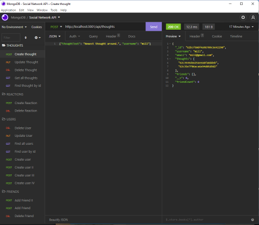
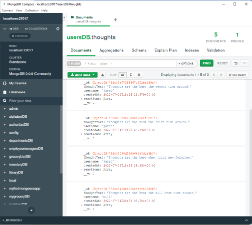

# Social Network API

# Description

The purpose of this project was to build a social network API with MongoDB, Express and Mongoose that allows the creation of new users, posting of thoughts and reactions to thoughts, addition and removal of friends from friend list.

# Installation

To install download the files from this repository and install Node, Express, MongoDB and Mongoose. Also install MongoDB Compass for a graphical user interface to your database.

Install Node: [Node.js](https://nodejs.org/en/download/).

Install Express: [Express.js](https://www.npmjs.com/package/express).

Install MongoDB: [MongoDB](https://coding-boot-camp.github.io/full-stack/mongodb/how-to-install-mongodb).

Install Mongoose: [Mongoose](https://www.npmjs.com/package/mongoose).

Install Mongo Compass: [Compass](https://docs.mongodb.com/compass/current/install/).

# Appearance

This application is an API only, there is no front end.

# User Story

AS A social media startup I WANT an API for my social network that uses a NoSQL database SO THAT my website can handle large amounts of unstructured data

# Usage

Use this API as a starting backend for a social networking application or similar use.

# API

To test this API use Insomnia or similar: [Insomnia](https://insomnia.rest/).

# Demonstration

[Video](https://drive.google.com/file/d/1aDa9gkOZEivsntE-wJ3ES_eNYzIg8YXO/view)

## Credits

Credits to Node.js, Express.js, MongoDB, Mongoose.
